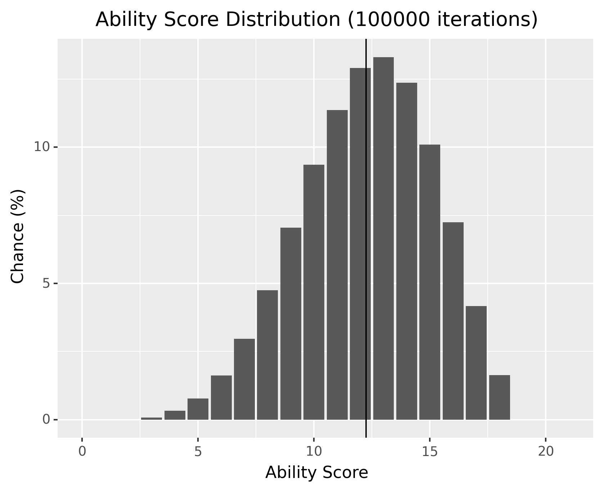
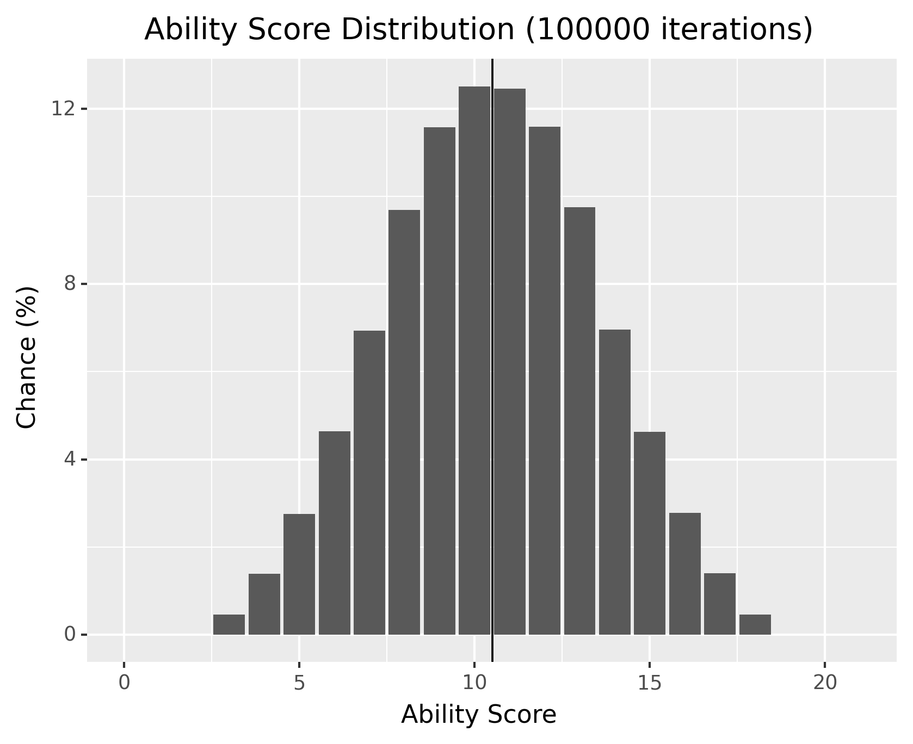
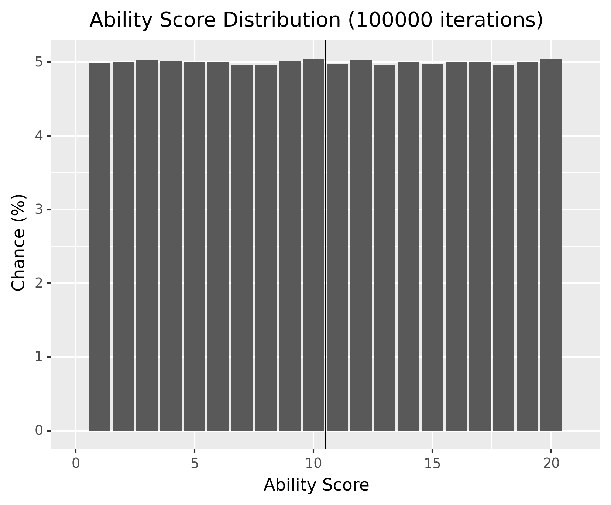

# DnD ability roll simulation
This is a Python script for simulating DnD ability roll methods in order to see the statistical distributions that they yield.

## Results
### 4d6 drop lowest
Roll 4 six sided dice, drop the lowest number, and sum the remaining 3 numbers. For example, if you roll (4, 6, 1, 3) you drop 1 and then sum (4, 6, 3) to get a score of 13.

This results in a discrete gaussian distribution with a mean of ~12.245 and a negative skew.



```
$ python __main__.py FourKeepThree --num_iterations 100000 --seed 42
    value  count    percent
0       3    457   0.076167
1       4   1913   0.318833
2       5   4638   0.773000
3       6   9735   1.622500
4       7  17773   2.962167
5       8  28478   4.746333
6       9  42246   7.041000
7      10  56128   9.354667
8      11  68220  11.370000
9      12  77491  12.915167
10     13  79867  13.311167
11     14  74235  12.372500
12     15  60615  10.102500
13     16  43448   7.241333
14     17  24995   4.165833
15     18   9761   1.626833

Mean: 12.245384999999999
Mode: 13.0
Standard deviation: 2.848316087639912
Skewness: -0.264933728133125
```

### 3d6
Roll 3 six sided dice and sum the resulting numbers. For example if you roll (6, 1, 3) you sum them to get a score of 10.

This results in a discrete gaussian distribution with a mean of 10.5 and no visibile skew. (skewness measure is a bit misleading due to the distribution deing discrete)



```
$ python __main__.py ThreeDSix --num_iterations 100000 --seed 42    
    value  count    percent
0       3   2759   0.459833
1       4   8349   1.391500
2       5  16485   2.747500
3       6  27853   4.642167
4       7  41611   6.935167
5       8  58178   9.696333
6       9  69459  11.576500
7      10  75105  12.517500
8      11  74792  12.465333
9      12  69586  11.597667
10     13  58539   9.756500
11     14  41739   6.956500
12     15  27741   4.623500
13     16  16660   2.776667
14     17   8383   1.397167
15     18   2761   0.460167

Mean: 10.503465
Mode: 10.0
Standard deviation: 2.957104100372807
Skewness: 0.17025609613693599
```

### 1d20
Roll 1 twenty sided dice and take the resulting number as your score.

This results in a uniform distribution with each possible score [1, 20] being equally likely to occur (5%).



```
$ python __main__.py SixDTwenty --num_iterations 100000 --seed 42
    value  count   percent
0       1  29949  4.991500
1       2  30048  5.008000
2       3  30149  5.024833
3       4  30106  5.017667
4       5  30052  5.008667
5       6  30008  5.001333
6       7  29762  4.960333
7       8  29790  4.965000
8       9  30115  5.019167
9      10  30295  5.049167
10     11  29837  4.972833
11     12  30163  5.027167
12     13  29797  4.966167
13     14  30044  5.007333
14     15  29872  4.978667
15     16  30001  5.000167
16     17  30011  5.001833
17     18  29773  4.962167
18     19  30007  5.001167
19     20  30221  5.036833

Mean: 10.497921666666667
Mode: 10.0
Standard deviation: 5.768411596548674
Skewness: 0.08631867860549003
```

## Notes
* One iteration results in 6 ability scores being generated. An iteration refers to a full roll of 6 ability scores (one for each of the 6 abilities).
* For the skewness metric, this script uses Pearson's first skewness coefficient. ([Wikipedia link](https://en.wikipedia.org/wiki/Skewness#Pearson's_first_skewness_coefficient_(mode_skewness)))